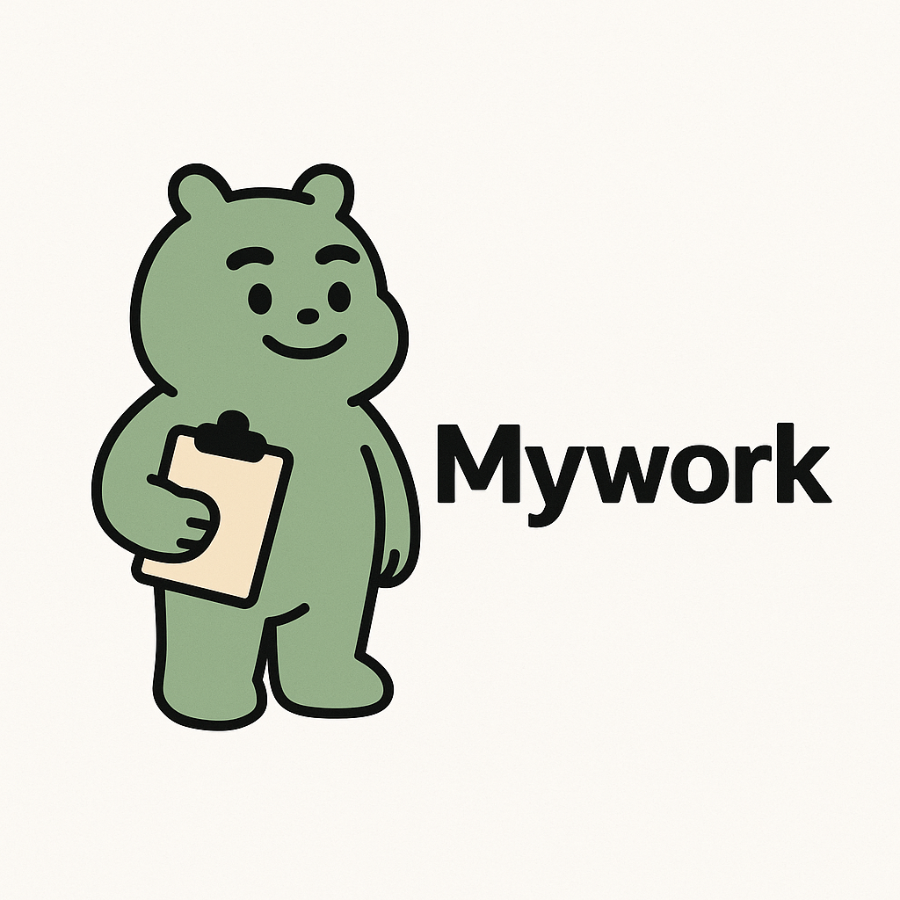
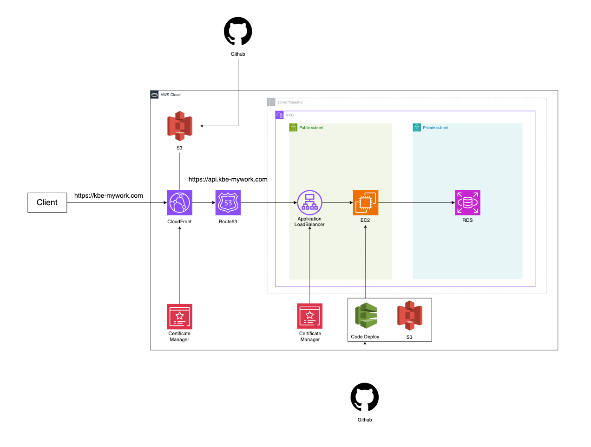

# MY-WORK

## 📝 1. 서비스 소개

|                                                    |
|:--------------------------------------------------:|
|  |

> **마이워크(MyWork)** 는 웹에이전시와 고객사 간의 커뮤니케이션을 혁신적으로 개선하기 위한 **프로젝트 관리 웹 시스템**입니다.
>
> - 프로젝트의 전 단계에 걸쳐 상태를 확인하고 기록할 수 있습니다.
> - **고객사는 자신에게 할당된 프로젝트를 실시간 확인**, 필요한 자료를 업로드하고, 각 업무에 대해 피드백 및 컨펌을 남길 수 있습니다.
    >   
    > 프로젝트의 흐름을 놓치지 않고, 고객사와 개발사 모두가 **신뢰할 수 있는 협업 환경**을 제공하는 것이 이 서비스의 핵심입니다.

 

## 🤔 2. 기획 의도

> - **"이메일과 전화로는 부족하다."** 많은 웹 개발사는 아직도 프로젝트를 이메일, 전화, 수기 문서 등으로 관리하고 있습니다. 이로 인해 생기는 **정보 누락, 불명확한 기록, 불필요한 오해**는 프로젝트의
    품질과 고객 신뢰에 직접적인 영향을 줍니다. 본 서비스는 이러한 비효율을 개선하기 위해 기획 되었습니다.
>
>- **하나의 플랫폼에서 프로젝트 히스토리를 통합 관리**하고, **고객사와 실시간 소통**하며, **정확한 승인을 문서화**할 수 있도록 설계하였습니다. 단순한 게시판이나 업무 툴을 넘어서, **웹 에이전시에
   특화된 실질적이고 현장 친화적인 시스템**을 구현하고자 했습니다.
   >   
   > 결과적으로, 고객사와 개발사가 **서로를 신뢰하며 협업할 수 있는 환경을 만드는 것**이 저희의 목표입니다.

 

## 🧑‍🔧 3. 서비스 기능

### (1) 시스템 관리자 기능

- 서비스의 모든 기능을 제공합니다.

1. 대시보드

- 프로젝트 통계 ( 전체, 진행중, 완료)
- 마감 임박 프로젝트
- 게시글 활동이 활발한 프로젝트

2. 프로젝트 관리

- 프로젝트 생성
- 프로젝트 목록 조회
- 프로젝트 삭제

3. 회원 관리

- 회원 생성
- 회원 삭제
- 회원 목록 조회

4. 로그 기록

- 변경이력 조회

### (2) 개발사 / 고객사 관리자 기능

- 개발사 / 고객사를 관리하는 기능을 제공합니다.

1. 대시보드

- 전체/진행/완료 프로젝트 수 조회 기능
- 프로젝트 금액 현황 조회 기능
    - 주간 / 월간 조회 기능
- 마감 임박 프로젝트 목록 조회
- 게시글이 활발한 프로젝트 TOP5

2. 알림 기능

- 알림 목록 조회
- 실시간 알림 푸시 기능

3. 프로젝트 관리

- 회사에 할당된 프로젝트 목록 조회
- 프로젝트 상세 조회
- 업무 관리
    - 게시글 기능
    - 리뷰 기능
- 체크리스트 관리
    - 단계별 체크리스트 조회
    - 결재 승인 기능 + 히스토리

4. 회원 관리

- 사원 목록 조회
- 검색 조건 기반 사원 필터링
- 사원 조회 / 수정 / 삭제

### (3) 유저 기능

- 본인이 담당한 프로젝트만 권한을 갖습니다.

1. 대시보드

- 프로젝트 통계 ( 전체, 진행중, 완료)
- 마감 임박 프로젝트
- 게시글 활동이 활발한 프로젝트

2. 알림 기능

- 알림 목록 조회
- 실시간 알림 푸시 기능

3. 프로젝트 관리

- 게시글 작성
- 댓글 작성
- 프로젝트 관련 내용 조회

## 🛠️ 4. 기술 스택

    <h3>Backend</h3>
    

         
        
         
        
    

    <h3>FrontEnd</h3>
    

        
        
        
        
    

    <h3>Infra</h3>
    

        
        
        

    

 

## 📍 5. 프로젝트 아키텍처

## 👥 팀원 (Team Member)

<table>
  <tr>
    <th>박병기</th>
    <th>강예주</th>
    <th>이수하</th>
    <th>함성준</th>
  </tr>
  <tr>
    <td></td>
    <td></td>
    <td></td>
    <td></td> 
  </tr>
  <tr>
    <td><a href="https://github.com/pbg0205/">@pbg0205</a></td>
    <td><a href="https://github.com/Yeju-Kang">@Yeju-Kang</a></td>
    <td><a href="https://github.com/leeesooha">@leeesooha</a></td>
    <td><a href="https://github.com/HMHMHMJUN">@HMHMHMJUN</a></td>
  </tr>
</table>

 
